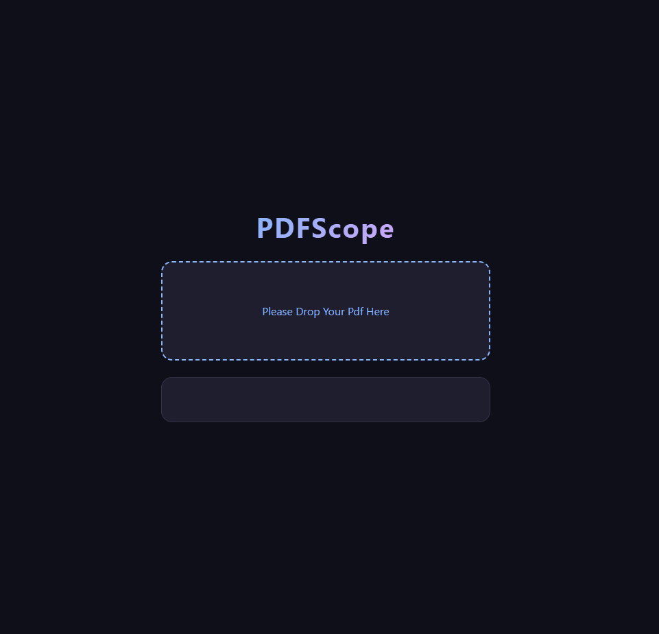
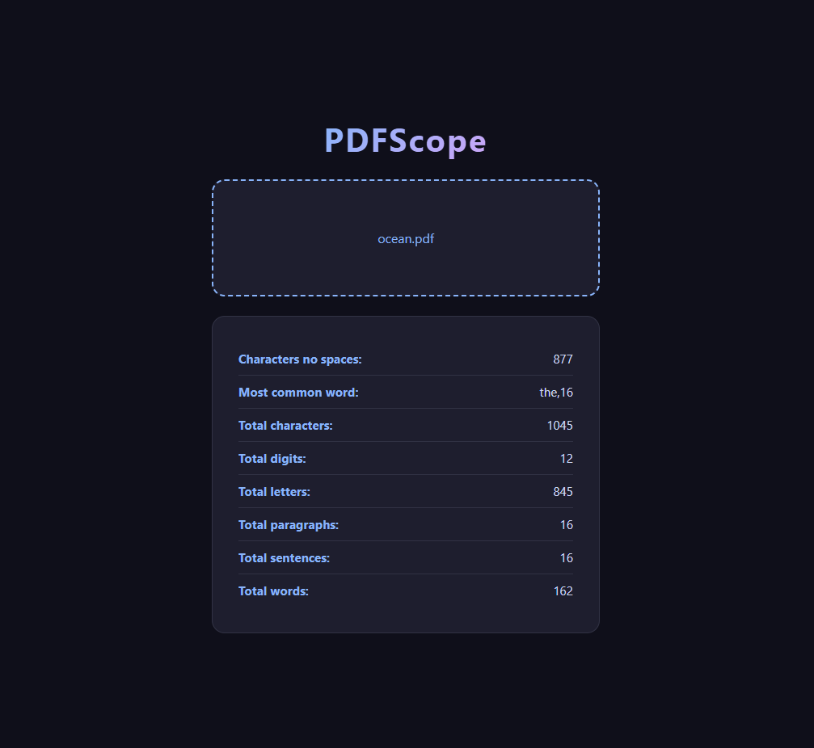

# PDFScope 🔍

A simple web application that analyzes PDF files and provides detailed text statistics. Just drag and drop your PDF and get instant results.




## Features

- Total character count
- Character count without spaces
- Total word count
- Total letter count
- Total digit count
- Total sentence count
- Total paragraph count
- Most common word

## Technologies

- **Python** — text analysis logic
- **Flask** — backend API
- **pypdf** — PDF text extraction
- **JavaScript** — drag and drop, fetch API
- **HTML/CSS** — frontend interface

## How to Run

1. Clone the repository
   ```
   git clone https://github.com/60yusuf60/PDFScope.git
   ```
2. Install dependencies
   ```
   pip install flask pypdf
   ```
3. Run the app
   ```
   python app.py
   ```
4. Open your browser and go to `http://127.0.0.1:5000`
5. Drag and drop any PDF file to analyze it!

## Project Structure

```
PDFScope/
├── static/
│   ├── index.html
│   ├── style.css
│   └── script.js
├── screenshots/
├── app.py
├── .gitignore
└── README.md
```